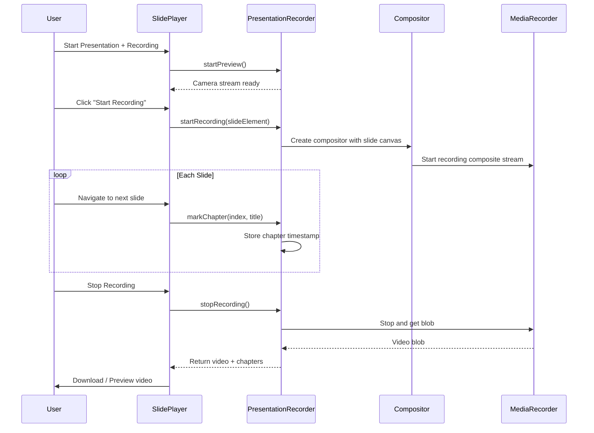

# ShotBoard 簡報系統模組技術規格

**版本**: 1.0.0
**日期**: 2024-12
**狀態**: 草案

---

## 目錄

1. [模組概述](#1-模組概述)
2. [用戶故事](#2-用戶故事)
3. [Markdown 簡報語法](#3-markdown-簡報語法)
4. [功能需求](#4-功能需求)
5. [數據模型](#5-數據模型)
6. [API 設計](#6-api-設計)
7. [組件規格](#7-組件規格)
8. [主題系統](#8-主題系統)
9. [白板標記模式](#9-白板標記模式)
10. [錄製整合](#10-錄製整合)
11. [快捷鍵](#11-快捷鍵)
12. [驗收標準](#12-驗收標準)

---

## 1. 模組概述

### 1.1 功能目標

簡報系統模組（Slidev-like）旨在讓用戶能夠：

- 使用熟悉的 Markdown 語法創建專業簡報
- 在簡報播放時進行即時白板標記
- 整合錄製功能，創建教學影片
- 支援演講者視圖與觀眾視圖分離
- 提供豐富的主題與動畫效果

### 1.2 功能範圍

#### 包含範圍 (In Scope)

| 類別 | 功能 |
|------|------|
| 核心功能 | Markdown 轉簡報、投影片播放、主題系統 |
| 標記功能 | 簡報中即時使用 Excalidraw 標記 |
| 錄製功能 | 簡報播放時同步錄製 |
| 視圖管理 | 演講者視圖、觀眾視圖、縮圖導覽 |
| 導出功能 | 導出為獨立 HTML、PDF |

#### 不包含範圍 (Out of Scope)

- 遠端協作簡報（Phase 5 功能）
- 雲端同步簡報（Phase 5 功能）
- 自定義動畫編輯器
- 3D 轉場效果

### 1.3 技術架構

```
┌─────────────────────────────────────────────────────────┐
│                    Presentation Layer                    │
│  ┌─────────────┐  ┌─────────────┐  ┌─────────────────┐  │
│  │ SlidePlayer │  │PresenterView│  │ ThumbnailNav    │  │
│  └─────────────┘  └─────────────┘  └─────────────────┘  │
├─────────────────────────────────────────────────────────┤
│                     State Layer                          │
│  ┌─────────────────────────────────────────────────┐    │
│  │              slideStore (Zustand)                │    │
│  └─────────────────────────────────────────────────┘    │
├─────────────────────────────────────────────────────────┤
│                    Parser Layer                          │
│  ┌─────────────┐  ┌─────────────┐  ┌─────────────────┐  │
│  │ SlideParser │  │LayoutEngine │  │ ThemeResolver   │  │
│  └─────────────┘  └─────────────┘  └─────────────────┘  │
├─────────────────────────────────────────────────────────┤
│                  Integration Layer                       │
│  ┌─────────────┐  ┌─────────────┐  ┌─────────────────┐  │
│  │WhiteboardInt│  │ RecorderInt │  │ ExportService   │  │
│  └─────────────┘  └─────────────┘  └─────────────────┘  │
└─────────────────────────────────────────────────────────┘
```

---

## 2. 用戶故事

### US-001: 創建 Markdown 簡報

**作為** 內容創作者
**我希望** 使用 Markdown 語法創建簡報
**以便** 快速製作專業的投影片而無需學習複雜工具

**驗收條件:**
- 可在編輯器中使用 `---` 分隔投影片
- 支援標準 Markdown 語法（標題、列表、程式碼區塊等）
- 即時預覽簡報效果

---

### US-002: 播放簡報

**作為** 演講者
**我希望** 以全螢幕模式播放簡報
**以便** 在會議或課堂中進行專業演講

**驗收條件:**
- 可進入全螢幕播放模式
- 支援鍵盤/滑鼠切換投影片
- 顯示當前頁碼與總頁數

---

### US-003: 使用演講者視圖

**作為** 演講者
**我希望** 在第二螢幕查看講者筆記與下一張投影片預覽
**以便** 更流暢地進行演講

**驗收條件:**
- 支援雙螢幕模式
- 演講者視圖顯示當前投影片、下一張預覽、講者筆記
- 顯示演講計時器

---

### US-004: 簡報中白板標記

**作為** 講師
**我希望** 在播放簡報時直接在投影片上畫重點
**以便** 即時強調關鍵內容

**驗收條件:**
- 可在任意投影片上啟用標記模式
- 標記使用 Excalidraw 引擎
- 標記可選擇保存或清除

---

### US-005: 嵌入白板繪圖

**作為** 教學內容創作者
**我希望** 在 Markdown 中嵌入預先繪製的 Excalidraw 白板
**以便** 展示複雜的圖解與示意圖

**驗收條件:**
- 支援 `::whiteboard{id="xxx"}` 語法
- 嵌入的白板正確渲染
- 可在編輯器中快速插入白板區塊

---

### US-006: 錄製簡報講解

**作為** 線上課程創作者
**我希望** 在播放簡報時同步錄製螢幕與攝影機
**以便** 製作教學影片

**驗收條件:**
- 可在簡報模式中啟用錄製
- 錄製包含投影片內容與攝影機畫面
- 錄製完成後可預覽並導出

---

### US-007: 套用簡報主題

**作為** 簡報製作者
**我希望** 選擇不同的視覺主題
**以便** 快速改變簡報的整體風格

**驗收條件:**
- 提供至少 4 種內建主題
- 可在 Front Matter 中指定主題
- 主題切換即時生效

---

### US-008: 導出簡報

**作為** 用戶
**我希望** 將簡報導出為 PDF 或獨立 HTML
**以便** 分享給沒有安裝 ShotBoard 的人

**驗收條件:**
- 可導出為 PDF（每頁一張投影片）
- 可導出為獨立 HTML（可離線播放）
- 嵌入的圖片與白板正確包含

---

### US-009: 投影片動畫

**作為** 簡報製作者
**我希望** 為投影片添加入場動畫與轉場效果
**以便** 增加簡報的視覺吸引力

**驗收條件:**
- 支援至少 5 種入場動畫
- 支援至少 3 種轉場效果
- 可在 Markdown 中指定動畫類型

---

### US-010: 投影片縮圖導覽

**作為** 演講者
**我希望** 查看所有投影片的縮圖並快速跳轉
**以便** 在 Q&A 時快速找到特定投影片

**驗收條件:**
- 按快捷鍵顯示縮圖面板
- 點擊縮圖跳轉到對應投影片
- 顯示投影片序號

---

## 3. Markdown 簡報語法

### 3.1 基本結構

```markdown
---
# Front Matter (YAML)
title: 簡報標題
theme: default
author: 作者名稱
date: 2024-12-26
aspectRatio: 16/9
---

# 第一張投影片

這是內容

---

# 第二張投影片

- 項目一
- 項目二

---
<!-- 這裡開始第三張投影片 -->

## 結論

謝謝大家
```

### 3.2 Front Matter 規格

| 欄位 | 類型 | 預設值 | 說明 |
|------|------|--------|------|
| `title` | string | "Untitled" | 簡報標題 |
| `theme` | string | "default" | 主題名稱 |
| `author` | string | "" | 作者名稱 |
| `date` | string | 當天日期 | 日期 |
| `aspectRatio` | string | "16/9" | 投影片比例 ("16/9", "4/3", "1/1") |
| `transition` | string | "slide" | 預設轉場效果 |
| `highlightTheme` | string | "dracula" | 程式碼高亮主題 |
| `fonts` | object | {} | 自定義字體設定 |

### 3.3 投影片分隔符

| 語法 | 說明 |
|------|------|
| `---` | 標準分頁符（三個以上連續減號） |
| `----` | 垂直分頁（用於投影片組） |

### 3.4 投影片 Metadata

每張投影片可有獨立的 metadata：

```markdown
---
layout: center
background: /images/bg.jpg
class: text-white
transition: fade
---

# 置中標題
```

#### 支援的投影片屬性

| 屬性 | 類型 | 說明 |
|------|------|------|
| `layout` | string | 佈局模式 |
| `background` | string | 背景圖片或顏色 |
| `class` | string | 額外 CSS class |
| `transition` | string | 該投影片的轉場效果 |
| `notes` | string | 講者筆記 |

### 3.5 佈局模式

| 佈局名稱 | 說明 | 範例用途 |
|----------|------|----------|
| `default` | 標準佈局，內容置頂 | 一般內容頁 |
| `center` | 水平垂直置中 | 標題頁、引言 |
| `cover` | 封面佈局 | 首頁 |
| `section` | 章節分隔頁 | 章節標題 |
| `two-cols` | 左右雙欄 | 對比內容 |
| `image-right` | 左文右圖 | 圖文並排 |
| `image-left` | 左圖右文 | 圖文並排 |
| `image` | 全版圖片 | 展示圖片 |
| `quote` | 引言佈局 | 名人名言 |
| `fact` | 數據展示 | 統計數字 |
| `end` | 結尾頁 | 謝謝觀看 |

### 3.6 雙欄佈局語法

```markdown
---
layout: two-cols
---

# 左側內容

這是左欄

::right::

# 右側內容

這是右欄
```

### 3.7 嵌入白板語法

```markdown
<!-- 嵌入現有白板 -->
::whiteboard{id="wb_123456"}

<!-- 創建新的內嵌白板區塊 -->
::whiteboard{width="800" height="400"}
```

### 3.8 動畫控制

#### 元素動畫

```markdown
<!-- 逐項顯示 -->
<v-clicks>

- 第一項 <!-- click 1 顯示 -->
- 第二項 <!-- click 2 顯示 -->
- 第三項 <!-- click 3 顯示 -->

</v-clicks>

<!-- 指定動畫類型 -->
<v-click animation="fade-in">

這段文字會淡入

</v-click>
```

#### 支援的動畫類型

| 動畫名稱 | 說明 |
|----------|------|
| `fade-in` | 淡入 |
| `fade-out` | 淡出 |
| `slide-up` | 從下往上滑入 |
| `slide-down` | 從上往下滑入 |
| `slide-left` | 從右往左滑入 |
| `slide-right` | 從左往右滑入 |
| `zoom-in` | 放大進入 |
| `bounce` | 彈跳進入 |

### 3.9 講者筆記

```markdown
# 投影片標題

內容...

<!-- 講者筆記 -->
<!--
這是講者筆記，只會在演講者視圖中顯示。
- 記得強調第二點
- 準備 Demo
-->
```

或使用 metadata：

```markdown
---
notes: |
  這是講者筆記
  可以多行
---

# 投影片標題
```

---

## 4. 功能需求

### 4.1 核心功能

| ID | 名稱 | 描述 | 優先級 |
|----|------|------|--------|
| FR-001 | Markdown 解析 | 將 Markdown 文件解析為投影片結構 | P0 |
| FR-002 | 簡報播放 | 以全螢幕模式播放簡報 | P0 |
| FR-003 | 投影片導覽 | 上一張/下一張/跳轉到指定頁 | P0 |
| FR-004 | Front Matter 解析 | 解析簡報層級的 metadata | P0 |
| FR-005 | 投影片 Metadata | 解析單張投影片的 metadata | P0 |

### 4.2 佈局功能

| ID | 名稱 | 描述 | 優先級 |
|----|------|------|--------|
| FR-010 | Default 佈局 | 標準內容佈局 | P0 |
| FR-011 | Center 佈局 | 置中佈局 | P0 |
| FR-012 | Cover 佈局 | 封面佈局 | P0 |
| FR-013 | Two-cols 佈局 | 雙欄佈局 | P1 |
| FR-014 | Image 佈局 | 圖片相關佈局 | P1 |
| FR-015 | 自定義佈局 | 支援自定義佈局模板 | P2 |

### 4.3 主題功能

| ID | 名稱 | 描述 | 優先級 |
|----|------|------|--------|
| FR-020 | 內建主題 | 提供 4+ 內建主題 | P0 |
| FR-021 | 主題切換 | 即時切換主題 | P0 |
| FR-022 | CSS Variables | 主題使用 CSS 變數 | P0 |
| FR-023 | 字體配置 | 可配置標題/內文字體 | P1 |
| FR-024 | 自定義主題 | 支援用戶自定義主題 | P2 |

### 4.4 動畫功能

| ID | 名稱 | 描述 | 優先級 |
|----|------|------|--------|
| FR-030 | 轉場動畫 | 投影片切換動畫 | P1 |
| FR-031 | 元素動畫 | 單一元素入場動畫 | P1 |
| FR-032 | v-clicks | 點擊逐項顯示 | P1 |
| FR-033 | 自定義動畫 | 支援自定義動畫參數 | P2 |

### 4.5 視圖功能

| ID | 名稱 | 描述 | 優先級 |
|----|------|------|--------|
| FR-040 | 演講者視圖 | 雙螢幕演講者視圖 | P0 |
| FR-041 | 講者筆記 | 顯示當前投影片筆記 | P0 |
| FR-042 | 下一張預覽 | 顯示下一張投影片 | P0 |
| FR-043 | 計時器 | 演講時間計時 | P1 |
| FR-044 | 縮圖導覽 | 投影片縮圖快速導覽 | P1 |

### 4.6 白板整合

| ID | 名稱 | 描述 | 優先級 |
|----|------|------|--------|
| FR-050 | 標記模式 | 簡報中即時白板標記 | P0 |
| FR-051 | 嵌入白板 | Markdown 中嵌入白板區塊 | P0 |
| FR-052 | 標記保存 | 可選擇保存標記內容 | P1 |
| FR-053 | 標記清除 | 一鍵清除當前標記 | P0 |
| FR-054 | 工具切換 | 快速切換標記工具 | P1 |

### 4.7 錄製整合

| ID | 名稱 | 描述 | 優先級 |
|----|------|------|--------|
| FR-060 | 簡報錄製 | 簡報模式中啟用錄製 | P0 |
| FR-061 | 攝影機畫中畫 | 錄製時顯示攝影機 | P0 |
| FR-062 | 錄製控制 | 暫停/繼續/停止錄製 | P1 |
| FR-063 | 自動章節 | 換頁時自動標記章節 | P2 |

### 4.8 導出功能

| ID | 名稱 | 描述 | 優先級 |
|----|------|------|--------|
| FR-070 | PDF 導出 | 導出為 PDF 文件 | P0 |
| FR-071 | HTML 導出 | 導出為獨立 HTML | P0 |
| FR-072 | PNG 導出 | 導出單張為圖片 | P1 |
| FR-073 | 資源打包 | 自動打包嵌入資源 | P0 |

---

## 5. 數據模型

### 5.1 核心類型定義

```typescript
// src/types/slide.ts

/**
 * 簡報投影片比例
 */
export type AspectRatio = '16/9' | '4/3' | '1/1' | '21/9';

/**
 * 轉場動畫類型
 */
export type TransitionType =
  | 'none'
  | 'slide'
  | 'slide-up'
  | 'fade'
  | 'zoom'
  | 'flip';

/**
 * 元素動畫類型
 */
export type AnimationType =
  | 'fade-in'
  | 'fade-out'
  | 'slide-up'
  | 'slide-down'
  | 'slide-left'
  | 'slide-right'
  | 'zoom-in'
  | 'bounce';

/**
 * 佈局類型
 */
export type LayoutType =
  | 'default'
  | 'center'
  | 'cover'
  | 'section'
  | 'two-cols'
  | 'image-right'
  | 'image-left'
  | 'image'
  | 'quote'
  | 'fact'
  | 'end';

/**
 * 簡報 metadata（Front Matter）
 */
export interface PresentationMeta {
  title: string;
  theme: string;
  author: string;
  date: string;
  aspectRatio: AspectRatio;
  transition: TransitionType;
  highlightTheme: string;
  fonts: FontConfig;
}

/**
 * 字體配置
 */
export interface FontConfig {
  sans?: string;
  serif?: string;
  mono?: string;
  heading?: string;
  weights?: string;
}

/**
 * 單張投影片 metadata
 */
export interface SlideMeta {
  layout: LayoutType;
  background?: string;
  class?: string;
  transition?: TransitionType;
  notes?: string;
  clicks?: number;  // 該投影片的 click 動畫數量
}

/**
 * 動畫元素
 */
export interface AnimatedElement {
  id: string;
  clickIndex: number;    // 在第幾次點擊時顯示
  animation: AnimationType;
  duration: number;      // 動畫持續時間 (ms)
  delay: number;         // 延遲時間 (ms)
}

/**
 * 嵌入內容
 */
export interface EmbeddedContent {
  type: 'whiteboard' | 'image' | 'video' | 'code';
  id: string;
  props: Record<string, any>;
}

/**
 * 單張投影片
 */
export interface Slide {
  id: string;
  index: number;           // 投影片序號 (0-based)
  rawContent: string;      // 原始 Markdown 內容
  htmlContent: string;     // 解析後的 HTML
  meta: SlideMeta;
  animatedElements: AnimatedElement[];
  embeddedContents: EmbeddedContent[];
}

/**
 * 簡報文件
 */
export interface Presentation {
  id: string;
  meta: PresentationMeta;
  slides: Slide[];
  createdAt: Date;
  updatedAt: Date;
  sourceFile?: string;     // 來源 Markdown 文件路徑
}
```

### 5.2 主題類型定義

```typescript
// src/types/theme.ts

/**
 * 主題顏色配置
 */
export interface ThemeColors {
  // 主色調
  primary: string;
  secondary: string;
  accent: string;

  // 背景色
  background: string;
  backgroundSecondary: string;

  // 文字色
  text: string;
  textSecondary: string;
  textMuted: string;

  // 功能色
  success: string;
  warning: string;
  error: string;
  info: string;

  // 程式碼
  codeBackground: string;
  codeForeground: string;
}

/**
 * 主題字體配置
 */
export interface ThemeTypography {
  fontFamily: {
    heading: string;
    body: string;
    mono: string;
  };
  fontSize: {
    h1: string;
    h2: string;
    h3: string;
    body: string;
    small: string;
    code: string;
  };
  fontWeight: {
    normal: number;
    medium: number;
    bold: number;
  };
  lineHeight: {
    tight: number;
    normal: number;
    relaxed: number;
  };
}

/**
 * 主題間距配置
 */
export interface ThemeSpacing {
  slidepadding: string;
  contentGap: string;
  sectionGap: string;
}

/**
 * 主題定義
 */
export interface SlideTheme {
  id: string;
  name: string;
  description: string;
  colors: ThemeColors;
  typography: ThemeTypography;
  spacing: ThemeSpacing;

  // 佈局樣式覆蓋
  layouts?: Partial<Record<LayoutType, React.CSSProperties>>;

  // 額外 CSS
  customCSS?: string;
}
```

### 5.3 播放狀態類型

```typescript
// src/types/slidePlayer.ts

/**
 * 播放模式
 */
export type PlayMode = 'normal' | 'presenter' | 'overview';

/**
 * 標記狀態
 */
export interface AnnotationState {
  enabled: boolean;
  tool: 'pen' | 'highlighter' | 'eraser' | 'pointer';
  color: string;
  strokeWidth: number;
  elements: any[];  // Excalidraw elements
}

/**
 * 播放狀態
 */
export interface PlayerState {
  isPlaying: boolean;
  isFullscreen: boolean;
  mode: PlayMode;
  currentSlideIndex: number;
  currentClickIndex: number;     // 當前投影片的動畫進度
  totalSlides: number;

  // 計時器
  startTime: Date | null;
  elapsedTime: number;           // 經過秒數

  // 標記
  annotation: AnnotationState;

  // 錄製狀態
  isRecording: boolean;
  recordingStartTime: Date | null;
}

/**
 * 簡報視窗配置
 */
export interface WindowConfig {
  presenterWindow: Window | null;
  audienceWindow: Window | null;
}
```

### 5.4 持久化格式

```typescript
// 簡報專案存檔格式 (.sbpres)
export interface PresentationFile {
  schemaVersion: string;        // "1.0.0"
  presentation: Presentation;
  whiteboards: Record<string, WhiteboardData>;  // 嵌入的白板資料
  annotations: Record<string, AnnotationData>;  // 各投影片的標記
  assets: Record<string, string>;               // 嵌入的資源 (base64)
}

export interface WhiteboardData {
  id: string;
  elements: any[];              // Excalidraw elements
  appState: any;                // Excalidraw app state
}

export interface AnnotationData {
  slideId: string;
  elements: any[];              // Excalidraw elements
  createdAt: Date;
}
```

---

## 6. API 設計

### 6.1 Zustand Store

```typescript
// src/stores/slideStore.ts

import { create } from 'zustand';
import type {
  Presentation,
  Slide,
  SlideTheme,
  PlayerState,
  AnnotationState
} from '../types/slide';

interface SlideStore {
  // === 狀態 ===
  presentation: Presentation | null;
  currentSlideIndex: number;
  currentClickIndex: number;
  isPlaying: boolean;
  isFullscreen: boolean;
  theme: SlideTheme;
  annotation: AnnotationState;

  // 計時器
  presentationStartTime: Date | null;
  elapsedSeconds: number;

  // 錄製整合
  isRecordingEnabled: boolean;

  // === 簡報管理 ===

  /**
   * 從 Markdown 解析簡報
   */
  parseFromMarkdown: (content: string) => Promise<void>;

  /**
   * 載入簡報檔案
   */
  loadPresentation: (data: Presentation) => void;

  /**
   * 清除當前簡報
   */
  clearPresentation: () => void;

  // === 導覽控制 ===

  /**
   * 下一步（下一個動畫或下一張投影片）
   */
  next: () => void;

  /**
   * 上一步
   */
  prev: () => void;

  /**
   * 下一張投影片
   */
  nextSlide: () => void;

  /**
   * 上一張投影片
   */
  prevSlide: () => void;

  /**
   * 跳轉到指定投影片
   */
  goToSlide: (index: number) => void;

  // === 播放控制 ===

  /**
   * 開始簡報
   */
  startPresentation: () => void;

  /**
   * 結束簡報
   */
  stopPresentation: () => void;

  /**
   * 切換全螢幕
   */
  toggleFullscreen: () => Promise<void>;

  /**
   * 開始計時
   */
  startTimer: () => void;

  /**
   * 暫停計時
   */
  pauseTimer: () => void;

  /**
   * 重置計時
   */
  resetTimer: () => void;

  // === 主題 ===

  /**
   * 設定主題
   */
  setTheme: (themeId: string) => void;

  /**
   * 載入自定義主題
   */
  loadCustomTheme: (theme: SlideTheme) => void;

  // === 標記功能 ===

  /**
   * 開啟/關閉標記模式
   */
  toggleAnnotation: () => void;

  /**
   * 設定標記工具
   */
  setAnnotationTool: (tool: AnnotationState['tool']) => void;

  /**
   * 設定標記顏色
   */
  setAnnotationColor: (color: string) => void;

  /**
   * 清除當前投影片標記
   */
  clearAnnotation: () => void;

  /**
   * 保存標記
   */
  saveAnnotation: () => void;

  // === 錄製整合 ===

  /**
   * 啟用/禁用錄製模式
   */
  setRecordingEnabled: (enabled: boolean) => void;
}

export const useSlideStore = create<SlideStore>((set, get) => ({
  // 初始狀態
  presentation: null,
  currentSlideIndex: 0,
  currentClickIndex: 0,
  isPlaying: false,
  isFullscreen: false,
  theme: getDefaultTheme(),
  annotation: {
    enabled: false,
    tool: 'pen',
    color: '#ff0000',
    strokeWidth: 2,
    elements: [],
  },
  presentationStartTime: null,
  elapsedSeconds: 0,
  isRecordingEnabled: false,

  // 實作將在組件中完成
  parseFromMarkdown: async (content) => { /* ... */ },
  loadPresentation: (data) => set({ presentation: data }),
  clearPresentation: () => set({ presentation: null, currentSlideIndex: 0 }),

  next: () => { /* ... */ },
  prev: () => { /* ... */ },
  nextSlide: () => { /* ... */ },
  prevSlide: () => { /* ... */ },
  goToSlide: (index) => set({ currentSlideIndex: index, currentClickIndex: 0 }),

  startPresentation: () => set({ isPlaying: true }),
  stopPresentation: () => set({ isPlaying: false, isFullscreen: false }),
  toggleFullscreen: async () => { /* ... */ },

  startTimer: () => set({ presentationStartTime: new Date() }),
  pauseTimer: () => { /* ... */ },
  resetTimer: () => set({ presentationStartTime: null, elapsedSeconds: 0 }),

  setTheme: (themeId) => { /* ... */ },
  loadCustomTheme: (theme) => set({ theme }),

  toggleAnnotation: () => set((state) => ({
    annotation: { ...state.annotation, enabled: !state.annotation.enabled }
  })),
  setAnnotationTool: (tool) => set((state) => ({
    annotation: { ...state.annotation, tool }
  })),
  setAnnotationColor: (color) => set((state) => ({
    annotation: { ...state.annotation, color }
  })),
  clearAnnotation: () => set((state) => ({
    annotation: { ...state.annotation, elements: [] }
  })),
  saveAnnotation: () => { /* ... */ },

  setRecordingEnabled: (enabled) => set({ isRecordingEnabled: enabled }),
}));
```

### 6.2 Custom Hooks

```typescript
// src/hooks/useSlideParser.ts

import { useCallback } from 'react';
import matter from 'gray-matter';
import type { Presentation, Slide, PresentationMeta } from '../types/slide';

interface UseSlideParserReturn {
  parseMarkdown: (content: string) => Presentation;
  parseSlide: (content: string, index: number) => Slide;
}

export function useSlideParser(): UseSlideParserReturn {
  const parseMarkdown = useCallback((content: string): Presentation => {
    // 解析 Front Matter
    const { data: frontMatter, content: body } = matter(content);

    // 分割投影片
    const slideContents = body.split(/^---+$/m).filter(s => s.trim());

    // 解析每張投影片
    const slides = slideContents.map((slideContent, index) =>
      parseSlide(slideContent, index)
    );

    return {
      id: generateId(),
      meta: parseMeta(frontMatter),
      slides,
      createdAt: new Date(),
      updatedAt: new Date(),
    };
  }, []);

  const parseSlide = useCallback((content: string, index: number): Slide => {
    // 解析投影片 metadata
    const { data: slideMeta, content: body } = matter(content);

    // 解析 HTML
    const htmlContent = parseMarkdownToHtml(body);

    // 解析動畫元素
    const animatedElements = parseAnimations(body);

    // 解析嵌入內容
    const embeddedContents = parseEmbeds(body);

    return {
      id: `slide_${index}`,
      index,
      rawContent: content,
      htmlContent,
      meta: {
        layout: slideMeta.layout || 'default',
        background: slideMeta.background,
        class: slideMeta.class,
        transition: slideMeta.transition,
        notes: slideMeta.notes || parseNotes(content),
        clicks: animatedElements.length,
      },
      animatedElements,
      embeddedContents,
    };
  }, []);

  return { parseMarkdown, parseSlide };
}
```

```typescript
// src/hooks/useSlideNavigation.ts

import { useCallback, useEffect } from 'react';
import { useSlideStore } from '../stores/slideStore';

interface UseSlideNavigationReturn {
  currentSlide: Slide | null;
  currentSlideIndex: number;
  totalSlides: number;
  canGoNext: boolean;
  canGoPrev: boolean;
  next: () => void;
  prev: () => void;
  goTo: (index: number) => void;
}

export function useSlideNavigation(): UseSlideNavigationReturn {
  const {
    presentation,
    currentSlideIndex,
    currentClickIndex,
    next,
    prev,
    goToSlide,
  } = useSlideStore();

  const currentSlide = presentation?.slides[currentSlideIndex] ?? null;
  const totalSlides = presentation?.slides.length ?? 0;

  const canGoNext = currentSlideIndex < totalSlides - 1 ||
    currentClickIndex < (currentSlide?.meta.clicks ?? 0);
  const canGoPrev = currentSlideIndex > 0 || currentClickIndex > 0;

  // 鍵盤導覽
  useEffect(() => {
    const handleKeyDown = (e: KeyboardEvent) => {
      if (e.key === 'ArrowRight' || e.key === ' ' || e.key === 'Enter') {
        e.preventDefault();
        next();
      } else if (e.key === 'ArrowLeft' || e.key === 'Backspace') {
        e.preventDefault();
        prev();
      }
    };

    window.addEventListener('keydown', handleKeyDown);
    return () => window.removeEventListener('keydown', handleKeyDown);
  }, [next, prev]);

  return {
    currentSlide,
    currentSlideIndex,
    totalSlides,
    canGoNext,
    canGoPrev,
    next,
    prev,
    goTo: goToSlide,
  };
}
```

```typescript
// src/hooks/usePresenterView.ts

import { useCallback, useEffect, useState } from 'react';
import { useSlideStore } from '../stores/slideStore';

interface UsePresenterViewReturn {
  isPresenterMode: boolean;
  presenterWindow: Window | null;
  openPresenterView: () => void;
  closePresenterView: () => void;
  syncState: () => void;
}

export function usePresenterView(): UsePresenterViewReturn {
  const [presenterWindow, setPresenterWindow] = useState<Window | null>(null);
  const { currentSlideIndex, currentClickIndex } = useSlideStore();

  const openPresenterView = useCallback(() => {
    const win = window.open(
      '/presenter',
      'presenter',
      'width=1024,height=768,menubar=no,toolbar=no'
    );
    setPresenterWindow(win);
  }, []);

  const closePresenterView = useCallback(() => {
    presenterWindow?.close();
    setPresenterWindow(null);
  }, [presenterWindow]);

  // 同步狀態到演講者視窗
  useEffect(() => {
    if (presenterWindow) {
      presenterWindow.postMessage({
        type: 'SLIDE_SYNC',
        payload: { currentSlideIndex, currentClickIndex }
      }, '*');
    }
  }, [presenterWindow, currentSlideIndex, currentClickIndex]);

  return {
    isPresenterMode: presenterWindow !== null,
    presenterWindow,
    openPresenterView,
    closePresenterView,
    syncState: () => {},
  };
}
```

```typescript
// src/hooks/usePresentationTimer.ts

import { useState, useEffect, useCallback } from 'react';

interface UsePresentationTimerReturn {
  elapsedTime: number;        // 秒數
  formattedTime: string;      // "00:00:00" 格式
  isRunning: boolean;
  start: () => void;
  pause: () => void;
  reset: () => void;
}

export function usePresentationTimer(): UsePresentationTimerReturn {
  const [startTime, setStartTime] = useState<number | null>(null);
  const [pausedTime, setPausedTime] = useState<number>(0);
  const [elapsedTime, setElapsedTime] = useState(0);
  const [isRunning, setIsRunning] = useState(false);

  useEffect(() => {
    let interval: NodeJS.Timeout;

    if (isRunning && startTime) {
      interval = setInterval(() => {
        setElapsedTime(Math.floor((Date.now() - startTime) / 1000) + pausedTime);
      }, 1000);
    }

    return () => clearInterval(interval);
  }, [isRunning, startTime, pausedTime]);

  const start = useCallback(() => {
    setStartTime(Date.now());
    setIsRunning(true);
  }, []);

  const pause = useCallback(() => {
    setPausedTime(elapsedTime);
    setIsRunning(false);
  }, [elapsedTime]);

  const reset = useCallback(() => {
    setStartTime(null);
    setPausedTime(0);
    setElapsedTime(0);
    setIsRunning(false);
  }, []);

  const formattedTime = formatTime(elapsedTime);

  return { elapsedTime, formattedTime, isRunning, start, pause, reset };
}

function formatTime(seconds: number): string {
  const h = Math.floor(seconds / 3600);
  const m = Math.floor((seconds % 3600) / 60);
  const s = seconds % 60;
  return `${h.toString().padStart(2, '0')}:${m.toString().padStart(2, '0')}:${s.toString().padStart(2, '0')}`;
}
```

---

## 7. 組件規格

### 7.1 SlidePlayer 組件

主要的簡報播放器組件。

```typescript
// src/components/Slides/SlidePlayer.tsx

interface SlidePlayerProps {
  /** 簡報資料 */
  presentation: Presentation;
  /** 初始投影片索引 */
  initialSlide?: number;
  /** 是否自動開始播放 */
  autoPlay?: boolean;
  /** 是否顯示控制列 */
  showControls?: boolean;
  /** 是否啟用標記模式 */
  enableAnnotation?: boolean;
  /** 投影片變更回調 */
  onSlideChange?: (index: number) => void;
  /** 簡報結束回調 */
  onEnd?: () => void;
  /** 自定義 className */
  className?: string;
}

/**
 * 簡報播放器組件
 *
 * 功能：
 * - 全螢幕簡報播放
 * - 鍵盤/滑鼠導覽
 * - 投影片動畫
 * - 即時標記覆蓋層
 *
 * 使用範例：
 * ```tsx
 * <SlidePlayer
 *   presentation={presentation}
 *   showControls
 *   enableAnnotation
 *   onSlideChange={(index) => console.log('Current slide:', index)}
 * />
 * ```
 */
export const SlidePlayer: React.FC<SlidePlayerProps>;
```

**內部結構：**

```
SlidePlayer
├── SlideContainer          # 投影片容器
│   ├── SlideContent        # 投影片內容渲染
│   └── AnimationLayer      # 動畫控制層
├── AnnotationOverlay       # 標記覆蓋層 (Excalidraw)
├── ControlBar              # 控制列
│   ├── SlideCounter        # 頁碼顯示
│   ├── NavigationButtons   # 導覽按鈕
│   ├── AnnotationTools     # 標記工具
│   └── FullscreenButton    # 全螢幕按鈕
└── ProgressBar             # 進度條
```

---

### 7.2 PresenterView 組件

演講者視圖組件，用於雙螢幕模式。

```typescript
// src/components/Slides/PresenterView.tsx

interface PresenterViewProps {
  /** 簡報資料 */
  presentation: Presentation;
  /** 當前投影片索引 */
  currentSlideIndex: number;
  /** 當前動畫索引 */
  currentClickIndex: number;
  /** 導覽回調 */
  onNavigate: (direction: 'next' | 'prev') => void;
  /** 跳轉回調 */
  onGoTo: (index: number) => void;
}

/**
 * 演講者視圖組件
 *
 * 功能：
 * - 顯示當前投影片
 * - 顯示下一張投影片預覽
 * - 顯示講者筆記
 * - 顯示計時器
 * - 投影片縮圖導覽
 */
export const PresenterView: React.FC<PresenterViewProps>;
```

**佈局設計：**

```
┌─────────────────────────────────────────────────────────────┐
│                      Presenter View                          │
├─────────────────────────────────────────────────────────────┤
│  ┌─────────────────────────┐  ┌───────────────────────────┐ │
│  │                         │  │                           │ │
│  │    Current Slide        │  │    Next Slide             │ │
│  │    (Large Preview)      │  │    (Small Preview)        │ │
│  │                         │  │                           │ │
│  │                         │  ├───────────────────────────┤ │
│  │                         │  │    Speaker Notes          │ │
│  │                         │  │                           │ │
│  │                         │  │    - Point 1              │ │
│  │                         │  │    - Point 2              │ │
│  │                         │  │                           │ │
│  └─────────────────────────┘  └───────────────────────────┘ │
├─────────────────────────────────────────────────────────────┤
│  [Slide 3 / 15]    [Timer: 00:05:32]    [<] [>] [Overview]  │
└─────────────────────────────────────────────────────────────┘
```

---

### 7.3 ThumbnailNavigator 組件

投影片縮圖導覽面板。

```typescript
// src/components/Slides/ThumbnailNavigator.tsx

interface ThumbnailNavigatorProps {
  /** 投影片列表 */
  slides: Slide[];
  /** 當前投影片索引 */
  currentIndex: number;
  /** 點擊縮圖回調 */
  onSelect: (index: number) => void;
  /** 是否顯示 */
  visible: boolean;
  /** 關閉回調 */
  onClose: () => void;
}

/**
 * 縮圖導覽組件
 *
 * 功能：
 * - 網格顯示所有投影片縮圖
 * - 高亮當前投影片
 * - 點擊跳轉
 * - 鍵盤導覽 (方向鍵)
 * - ESC 關閉
 */
export const ThumbnailNavigator: React.FC<ThumbnailNavigatorProps>;
```

---

### 7.4 SlideRenderer 組件

投影片內容渲染器，處理不同佈局。

```typescript
// src/components/Slides/SlideRenderer.tsx

interface SlideRendererProps {
  /** 投影片資料 */
  slide: Slide;
  /** 主題 */
  theme: SlideTheme;
  /** 當前動畫進度 */
  clickIndex: number;
  /** 是否為預覽模式 (縮小顯示) */
  preview?: boolean;
  /** 縮放比例 */
  scale?: number;
}

/**
 * 投影片渲染器
 *
 * 功能：
 * - 根據 layout 渲染不同佈局
 * - 套用主題樣式
 * - 處理動畫顯示狀態
 * - 渲染嵌入內容 (白板、圖片等)
 */
export const SlideRenderer: React.FC<SlideRendererProps>;
```

---

### 7.5 AnnotationToolbar 組件

標記工具列組件。

```typescript
// src/components/Slides/AnnotationToolbar.tsx

interface AnnotationToolbarProps {
  /** 當前工具 */
  currentTool: 'pen' | 'highlighter' | 'eraser' | 'pointer';
  /** 當前顏色 */
  currentColor: string;
  /** 當前筆畫寬度 */
  strokeWidth: number;
  /** 工具變更回調 */
  onToolChange: (tool: string) => void;
  /** 顏色變更回調 */
  onColorChange: (color: string) => void;
  /** 寬度變更回調 */
  onStrokeWidthChange: (width: number) => void;
  /** 清除回調 */
  onClear: () => void;
  /** 撤銷回調 */
  onUndo: () => void;
}

/**
 * 標記工具列
 *
 * 工具選項：
 * - 畫筆 (紅、藍、綠、黃、黑、白)
 * - 螢光筆 (半透明)
 * - 橡皮擦
 * - 雷射筆 (只顯示不保存)
 *
 * 額外功能：
 * - 撤銷
 * - 清除全部
 * - 保存標記
 */
export const AnnotationToolbar: React.FC<AnnotationToolbarProps>;
```

---

### 7.6 SlideEditor 組件

簡報編輯器組件（與 Markdown 編輯器整合）。

```typescript
// src/components/Slides/SlideEditor.tsx

interface SlideEditorProps {
  /** 初始 Markdown 內容 */
  initialContent?: string;
  /** 內容變更回調 */
  onChange: (content: string) => void;
  /** 預覽簡報回調 */
  onPreview: (presentation: Presentation) => void;
  /** 開始簡報回調 */
  onPresent: (presentation: Presentation) => void;
}

/**
 * 簡報編輯器
 *
 * 功能：
 * - 左側 Markdown 編輯
 * - 右側即時投影片預覽
 * - 快速插入工具列
 * - 主題選擇器
 */
export const SlideEditor: React.FC<SlideEditorProps>;
```

---

## 8. 主題系統

### 8.1 CSS Variables 規格

所有主題必須定義以下 CSS 變數：

```css
:root {
  /* === 顏色 === */
  --slide-color-primary: #3b82f6;
  --slide-color-secondary: #6366f1;
  --slide-color-accent: #f59e0b;

  --slide-color-background: #ffffff;
  --slide-color-background-secondary: #f3f4f6;

  --slide-color-text: #1f2937;
  --slide-color-text-secondary: #4b5563;
  --slide-color-text-muted: #9ca3af;

  --slide-color-code-bg: #1e1e1e;
  --slide-color-code-fg: #d4d4d4;

  /* === 字體 === */
  --slide-font-heading: 'Inter', 'Noto Sans TC', sans-serif;
  --slide-font-body: 'Inter', 'Noto Sans TC', sans-serif;
  --slide-font-mono: 'Fira Code', 'Source Code Pro', monospace;

  --slide-font-size-h1: 3.5rem;
  --slide-font-size-h2: 2.5rem;
  --slide-font-size-h3: 1.75rem;
  --slide-font-size-body: 1.25rem;
  --slide-font-size-small: 1rem;
  --slide-font-size-code: 0.9rem;

  --slide-font-weight-normal: 400;
  --slide-font-weight-medium: 500;
  --slide-font-weight-bold: 700;

  --slide-line-height-tight: 1.2;
  --slide-line-height-normal: 1.6;
  --slide-line-height-relaxed: 1.8;

  /* === 間距 === */
  --slide-padding: 4rem;
  --slide-content-gap: 1.5rem;
  --slide-section-gap: 3rem;

  /* === 動畫 === */
  --slide-transition-duration: 300ms;
  --slide-transition-easing: cubic-bezier(0.4, 0, 0.2, 1);

  /* === 陰影 === */
  --slide-shadow-sm: 0 1px 2px rgba(0, 0, 0, 0.05);
  --slide-shadow-md: 0 4px 6px rgba(0, 0, 0, 0.1);
  --slide-shadow-lg: 0 10px 15px rgba(0, 0, 0, 0.1);

  /* === 圓角 === */
  --slide-radius-sm: 0.25rem;
  --slide-radius-md: 0.5rem;
  --slide-radius-lg: 1rem;
}
```

### 8.2 內建主題

#### Theme: Default (Light)

```typescript
const defaultTheme: SlideTheme = {
  id: 'default',
  name: '預設',
  description: '乾淨明亮的預設主題',
  colors: {
    primary: '#3b82f6',
    secondary: '#6366f1',
    accent: '#f59e0b',
    background: '#ffffff',
    backgroundSecondary: '#f3f4f6',
    text: '#1f2937',
    textSecondary: '#4b5563',
    textMuted: '#9ca3af',
    success: '#10b981',
    warning: '#f59e0b',
    error: '#ef4444',
    info: '#3b82f6',
    codeBackground: '#1e1e1e',
    codeForeground: '#d4d4d4',
  },
  typography: { /* ... */ },
  spacing: { /* ... */ },
};
```

#### Theme: Dark

```typescript
const darkTheme: SlideTheme = {
  id: 'dark',
  name: '暗黑',
  description: '深色護眼主題',
  colors: {
    primary: '#60a5fa',
    secondary: '#818cf8',
    accent: '#fbbf24',
    background: '#1a1a2e',
    backgroundSecondary: '#16213e',
    text: '#e5e7eb',
    textSecondary: '#9ca3af',
    textMuted: '#6b7280',
    success: '#34d399',
    warning: '#fbbf24',
    error: '#f87171',
    info: '#60a5fa',
    codeBackground: '#0d1117',
    codeForeground: '#c9d1d9',
  },
  typography: { /* ... */ },
  spacing: { /* ... */ },
};
```

#### Theme: Minimal

```typescript
const minimalTheme: SlideTheme = {
  id: 'minimal',
  name: '極簡',
  description: '極簡黑白風格',
  colors: {
    primary: '#000000',
    secondary: '#333333',
    accent: '#666666',
    background: '#ffffff',
    backgroundSecondary: '#fafafa',
    text: '#000000',
    textSecondary: '#333333',
    textMuted: '#666666',
    /* ... */
  },
  typography: {
    fontFamily: {
      heading: '"Helvetica Neue", Arial, sans-serif',
      body: '"Helvetica Neue", Arial, sans-serif',
      mono: 'Menlo, Monaco, monospace',
    },
    /* ... */
  },
  spacing: { /* ... */ },
};
```

#### Theme: Gradient

```typescript
const gradientTheme: SlideTheme = {
  id: 'gradient',
  name: '漸層',
  description: '炫彩漸層背景',
  colors: {
    primary: '#8b5cf6',
    secondary: '#ec4899',
    accent: '#06b6d4',
    background: 'linear-gradient(135deg, #667eea 0%, #764ba2 100%)',
    backgroundSecondary: 'linear-gradient(135deg, #f093fb 0%, #f5576c 100%)',
    text: '#ffffff',
    textSecondary: 'rgba(255, 255, 255, 0.9)',
    textMuted: 'rgba(255, 255, 255, 0.7)',
    /* ... */
  },
  typography: { /* ... */ },
  spacing: { /* ... */ },
};
```

### 8.3 主題切換機制

```typescript
// src/utils/themeResolver.ts

import { SlideTheme } from '../types/theme';

const builtinThemes: Record<string, SlideTheme> = {
  default: defaultTheme,
  dark: darkTheme,
  minimal: minimalTheme,
  gradient: gradientTheme,
};

/**
 * 解析主題名稱為主題對象
 */
export function resolveTheme(themeId: string): SlideTheme {
  return builtinThemes[themeId] ?? builtinThemes.default;
}

/**
 * 套用主題 CSS 變數
 */
export function applyTheme(theme: SlideTheme, element: HTMLElement): void {
  const { colors, typography, spacing } = theme;

  // 顏色
  element.style.setProperty('--slide-color-primary', colors.primary);
  element.style.setProperty('--slide-color-secondary', colors.secondary);
  element.style.setProperty('--slide-color-accent', colors.accent);
  element.style.setProperty('--slide-color-background', colors.background);
  element.style.setProperty('--slide-color-text', colors.text);
  // ... 其他變數

  // 字體
  element.style.setProperty('--slide-font-heading', typography.fontFamily.heading);
  element.style.setProperty('--slide-font-body', typography.fontFamily.body);
  element.style.setProperty('--slide-font-mono', typography.fontFamily.mono);
  // ... 其他變數
}

/**
 * 獲取所有可用主題
 */
export function getAvailableThemes(): SlideTheme[] {
  return Object.values(builtinThemes);
}
```

---

## 9. 白板標記模式

### 9.1 標記模式架構

```
┌───────────────────────────────────────────────────────┐
│                    SlidePlayer                         │
│  ┌─────────────────────────────────────────────────┐  │
│  │              SlideContent Layer                  │  │
│  │                 (z-index: 1)                     │  │
│  └─────────────────────────────────────────────────┘  │
│  ┌─────────────────────────────────────────────────┐  │
│  │           Annotation Overlay Layer               │  │
│  │              (z-index: 100)                      │  │
│  │                                                  │  │
│  │   ┌─────────────────────────────────────────┐   │  │
│  │   │     Excalidraw Instance (Transparent)   │   │  │
│  │   │     - Pointer events: auto when active  │   │  │
│  │   │     - Pointer events: none when inactive│   │  │
│  │   └─────────────────────────────────────────┘   │  │
│  │                                                  │  │
│  └─────────────────────────────────────────────────┘  │
│  ┌─────────────────────────────────────────────────┐  │
│  │           Annotation Toolbar Layer               │  │
│  │              (z-index: 200)                      │  │
│  └─────────────────────────────────────────────────┘  │
└───────────────────────────────────────────────────────┘
```

### 9.2 標記覆蓋層組件

```typescript
// src/components/Slides/AnnotationOverlay.tsx

interface AnnotationOverlayProps {
  /** 是否啟用標記 */
  enabled: boolean;
  /** 當前工具 */
  tool: 'pen' | 'highlighter' | 'eraser' | 'pointer';
  /** 畫筆顏色 */
  color: string;
  /** 筆畫寬度 */
  strokeWidth: number;
  /** 現有標記元素 */
  elements: ExcalidrawElement[];
  /** 元素變更回調 */
  onElementsChange: (elements: ExcalidrawElement[]) => void;
  /** 投影片尺寸 */
  slideSize: { width: number; height: number };
}

/**
 * 標記覆蓋層
 *
 * 特性：
 * - 透明背景的 Excalidraw 實例
 * - 支援快速工具切換
 * - 標記可隨投影片儲存或丟棄
 */
export const AnnotationOverlay: React.FC<AnnotationOverlayProps>;
```

### 9.3 標記工具對應

| 工具 | Excalidraw 設定 | 視覺效果 |
|------|----------------|----------|
| Pen (畫筆) | `type: "freedraw"`, 正常透明度 | 實線筆跡 |
| Highlighter (螢光筆) | `type: "freedraw"`, `opacity: 50` | 半透明寬線 |
| Eraser (橡皮擦) | 點擊元素刪除 | 點擊清除 |
| Pointer (雷射筆) | 顯示紅點，不保存 | 臨時指示 |

### 9.4 標記儲存策略

```typescript
interface AnnotationStorage {
  /**
   * 儲存投影片標記
   */
  saveAnnotation(slideId: string, elements: ExcalidrawElement[]): void;

  /**
   * 載入投影片標記
   */
  loadAnnotation(slideId: string): ExcalidrawElement[];

  /**
   * 清除投影片標記
   */
  clearAnnotation(slideId: string): void;

  /**
   * 清除所有標記
   */
  clearAllAnnotations(): void;
}
```

---

## 10. 錄製整合

### 10.1 整合架構

```
┌─────────────────────────────────────────────────────────────┐
│                    Recording Integration                     │
├─────────────────────────────────────────────────────────────┤
│                                                              │
│  ┌─────────────────┐      ┌─────────────────────────────┐   │
│  │   SlidePlayer   │ ──── │      Compositor              │   │
│  │                 │      │  (from useRecorder)          │   │
│  │  - Slide Canvas │      │                              │   │
│  │  - Annotations  │      │  ┌─────────────────────────┐ │   │
│  └─────────────────┘      │  │  Main: Slide Canvas     │ │   │
│          │                │  ├─────────────────────────┤ │   │
│          │                │  │  PiP: Camera Bubble     │ │   │
│          ▼                │  └─────────────────────────┘ │   │
│  ┌─────────────────┐      │                              │   │
│  │  Camera Stream  │ ──── │         Output Stream        │   │
│  │                 │      │              │                │   │
│  └─────────────────┘      └──────────────│────────────────┘   │
│                                          │                    │
│                                          ▼                    │
│                              ┌───────────────────────┐        │
│                              │    MediaRecorder       │        │
│                              │                        │        │
│                              │    Output: WebM        │        │
│                              └───────────────────────┘        │
│                                                              │
└─────────────────────────────────────────────────────────────┘
```

### 10.2 簡報錄製 Hook

```typescript
// src/hooks/usePresentationRecorder.ts

interface UsePresentationRecorderReturn {
  /** 是否正在錄製 */
  isRecording: boolean;
  /** 是否正在預覽攝影機 */
  isPreviewing: boolean;
  /** 攝影機串流 */
  cameraStream: MediaStream | null;
  /** 錄製持續時間（秒） */
  duration: number;

  /** 開始攝影機預覽 */
  startPreview: () => Promise<void>;
  /** 停止預覽 */
  stopPreview: () => void;
  /** 開始錄製簡報 */
  startRecording: (slideElement: HTMLElement) => Promise<void>;
  /** 暫停錄製 */
  pauseRecording: () => void;
  /** 繼續錄製 */
  resumeRecording: () => void;
  /** 停止錄製並取得影片 */
  stopRecording: () => Promise<Blob>;

  /** 標記章節 (投影片切換時) */
  markChapter: (slideIndex: number, slideTitle: string) => void;
}

export function usePresentationRecorder(): UsePresentationRecorderReturn {
  // 複用現有 useRecorder 邏輯
  // 新增簡報專用功能
}
```

### 10.3 錄製流程



### 10.4 章節標記格式

```typescript
interface ChapterMarker {
  timestamp: number;      // 毫秒
  slideIndex: number;
  title: string;
}

interface RecordingMetadata {
  presentationTitle: string;
  recordedAt: Date;
  duration: number;
  chapters: ChapterMarker[];
}
```

---

## 11. 快捷鍵

### 11.1 播放模式快捷鍵

| 快捷鍵 | 功能 | 說明 |
|--------|------|------|
| `→` / `Space` / `Enter` | 下一步 | 下一個動畫或下一頁 |
| `←` / `Backspace` | 上一步 | 上一個動畫或上一頁 |
| `↑` / `PageUp` | 上一張投影片 | 跳過動畫 |
| `↓` / `PageDown` | 下一張投影片 | 跳過動畫 |
| `Home` | 第一張 | 跳到開頭 |
| `End` | 最後一張 | 跳到結尾 |
| `G` + 數字 + `Enter` | 跳轉 | 跳到指定頁 |
| `F` / `F11` | 全螢幕 | 切換全螢幕 |
| `Escape` | 退出 | 退出簡報模式 |
| `O` | 總覽 | 顯示縮圖導覽 |
| `P` | 演講者視圖 | 開啟演講者視窗 |

### 11.2 標記模式快捷鍵

| 快捷鍵 | 功能 | 說明 |
|--------|------|------|
| `D` | 畫筆模式 | 切換到畫筆 |
| `H` | 螢光筆 | 切換到螢光筆 |
| `E` | 橡皮擦 | 切換到橡皮擦 |
| `L` | 雷射筆 | 切換到雷射筆 |
| `C` | 清除 | 清除當前標記 |
| `Ctrl+Z` | 撤銷 | 撤銷上一筆 |
| `1-5` | 顏色 | 快速選擇顏色 |
| `[` / `]` | 筆畫大小 | 減少/增加筆畫寬度 |
| `A` | 切換標記 | 開啟/關閉標記模式 |

### 11.3 錄製模式快捷鍵

| 快捷鍵 | 功能 | 說明 |
|--------|------|------|
| `R` | 開始錄製 | 開始/暫停錄製 |
| `Ctrl+Shift+R` | 停止錄製 | 停止並儲存 |
| `M` | 靜音 | 切換麥克風 |
| `V` | 攝影機 | 切換攝影機顯示 |

### 11.4 快捷鍵實作

```typescript
// src/hooks/useSlideHotkeys.ts

import { useEffect } from 'react';
import { useSlideStore } from '../stores/slideStore';

export function useSlideHotkeys() {
  const {
    next,
    prev,
    nextSlide,
    prevSlide,
    goToSlide,
    toggleFullscreen,
    toggleAnnotation,
    setAnnotationTool,
    clearAnnotation,
  } = useSlideStore();

  useEffect(() => {
    const handleKeyDown = (e: KeyboardEvent) => {
      // 避免在輸入框中觸發
      if (e.target instanceof HTMLInputElement ||
          e.target instanceof HTMLTextAreaElement) {
        return;
      }

      switch (e.key) {
        case 'ArrowRight':
        case ' ':
        case 'Enter':
          e.preventDefault();
          next();
          break;

        case 'ArrowLeft':
        case 'Backspace':
          e.preventDefault();
          prev();
          break;

        case 'ArrowUp':
        case 'PageUp':
          e.preventDefault();
          prevSlide();
          break;

        case 'ArrowDown':
        case 'PageDown':
          e.preventDefault();
          nextSlide();
          break;

        case 'f':
        case 'F11':
          e.preventDefault();
          toggleFullscreen();
          break;

        case 'Escape':
          // 處理退出
          break;

        case 'a':
          e.preventDefault();
          toggleAnnotation();
          break;

        case 'd':
          e.preventDefault();
          setAnnotationTool('pen');
          break;

        case 'h':
          e.preventDefault();
          setAnnotationTool('highlighter');
          break;

        case 'e':
          e.preventDefault();
          setAnnotationTool('eraser');
          break;

        case 'l':
          e.preventDefault();
          setAnnotationTool('pointer');
          break;

        case 'c':
          if (!e.ctrlKey && !e.metaKey) {
            e.preventDefault();
            clearAnnotation();
          }
          break;
      }
    };

    window.addEventListener('keydown', handleKeyDown);
    return () => window.removeEventListener('keydown', handleKeyDown);
  }, [next, prev, nextSlide, prevSlide, toggleFullscreen,
      toggleAnnotation, setAnnotationTool, clearAnnotation]);
}
```

---

## 12. 驗收標準

### 12.1 Markdown 解析 (FR-001)

| 測試項目 | 預期結果 | 狀態 |
|----------|----------|------|
| 解析 Front Matter | 正確解析 title, theme, author 等欄位 | [ ] |
| `---` 分頁符 | 正確分割為多張投影片 | [ ] |
| 投影片 metadata | 正確解析 layout, background, class | [ ] |
| 標準 Markdown 語法 | 標題、列表、粗體斜體正確渲染 | [ ] |
| 程式碼區塊 | 語法高亮正確顯示 | [ ] |
| 空白處理 | 前後空白正確處理，不影響分頁 | [ ] |

### 12.2 簡報播放 (FR-002, FR-003)

| 測試項目 | 預期結果 | 狀態 |
|----------|----------|------|
| 進入播放模式 | 點擊播放按鈕進入全螢幕 | [ ] |
| 鍵盤導覽 | 方向鍵、Space、Enter 正確切換 | [ ] |
| 滑鼠點擊導覽 | 點擊畫面右側下一張，左側上一張 | [ ] |
| 頁碼顯示 | 正確顯示 "3 / 15" 格式 | [ ] |
| 首尾頁處理 | 第一張按 Prev 不動，最後一張按 Next 不動 | [ ] |
| 退出播放 | ESC 正確退出播放模式 | [ ] |

### 12.3 佈局系統 (FR-010 ~ FR-015)

| 測試項目 | 預期結果 | 狀態 |
|----------|----------|------|
| Default 佈局 | 內容從頂部開始排列 | [ ] |
| Center 佈局 | 內容水平垂直置中 | [ ] |
| Two-cols 佈局 | 正確顯示左右雙欄 | [ ] |
| Image-right 佈局 | 左文右圖正確排列 | [ ] |
| 背景圖片 | background 屬性正確顯示圖片 | [ ] |
| 自定義 class | class 屬性正確套用 | [ ] |

### 12.4 主題系統 (FR-020 ~ FR-024)

| 測試項目 | 預期結果 | 狀態 |
|----------|----------|------|
| 預設主題 | 未指定時使用 default 主題 | [ ] |
| 主題切換 | Front Matter theme 屬性正確套用 | [ ] |
| 深色主題 | dark 主題正確顯示深色背景與淺色文字 | [ ] |
| 字體配置 | 自定義字體正確套用 | [ ] |
| CSS Variables | 主題變數可被 CSS 讀取 | [ ] |

### 12.5 動畫系統 (FR-030 ~ FR-033)

| 測試項目 | 預期結果 | 狀態 |
|----------|----------|------|
| 轉場動畫 | 投影片切換時顯示轉場效果 | [ ] |
| v-clicks | 點擊時逐項顯示內容 | [ ] |
| fade-in 動畫 | 元素正確淡入顯示 | [ ] |
| slide-up 動畫 | 元素從下方滑入 | [ ] |
| 動畫順序 | 多個動畫按 clickIndex 順序執行 | [ ] |

### 12.6 演講者視圖 (FR-040 ~ FR-044)

| 測試項目 | 預期結果 | 狀態 |
|----------|----------|------|
| 開啟演講者視窗 | 按 P 開啟新視窗 | [ ] |
| 當前投影片顯示 | 大尺寸顯示當前投影片 | [ ] |
| 下一張預覽 | 小尺寸顯示下一張投影片 | [ ] |
| 講者筆記 | 正確顯示筆記內容 | [ ] |
| 計時器 | 正確顯示經過時間 | [ ] |
| 狀態同步 | 主視窗切換投影片時演講者視窗同步 | [ ] |

### 12.7 白板標記 (FR-050 ~ FR-054)

| 測試項目 | 預期結果 | 狀態 |
|----------|----------|------|
| 進入標記模式 | 按 A 或點擊按鈕啟用標記 | [ ] |
| 畫筆工具 | 可自由繪製線條 | [ ] |
| 螢光筆 | 半透明寬線正確顯示 | [ ] |
| 橡皮擦 | 可清除指定標記 | [ ] |
| 雷射筆 | 顯示指示點但不保存 | [ ] |
| 顏色切換 | 可切換不同顏色 | [ ] |
| 清除標記 | 一鍵清除當前頁所有標記 | [ ] |
| 保存標記 | 標記可保存到投影片 | [ ] |

### 12.8 錄製整合 (FR-060 ~ FR-063)

| 測試項目 | 預期結果 | 狀態 |
|----------|----------|------|
| 簡報中啟用錄製 | 可在簡報模式開始錄製 | [ ] |
| 攝影機畫中畫 | 攝影機泡泡正確顯示在角落 | [ ] |
| 錄製投影片內容 | 錄製結果包含投影片畫面 | [ ] |
| 錄製標記內容 | 標記內容被錄製 | [ ] |
| 暫停/繼續 | 可暫停和繼續錄製 | [ ] |
| 輸出格式 | 正確輸出 WebM 格式 | [ ] |

### 12.9 導出功能 (FR-070 ~ FR-073)

| 測試項目 | 預期結果 | 狀態 |
|----------|----------|------|
| PDF 導出 | 導出多頁 PDF，每頁一張投影片 | [ ] |
| PDF 比例 | PDF 維持正確的投影片比例 | [ ] |
| HTML 導出 | 導出可獨立運行的 HTML 檔案 | [ ] |
| 離線播放 | 導出的 HTML 可離線播放 | [ ] |
| 資源嵌入 | 圖片與白板正確嵌入導出檔案 | [ ] |

### 12.10 效能標準

| 項目 | 標準 | 狀態 |
|------|------|------|
| Markdown 解析 | < 100ms (50 頁以內) | [ ] |
| 投影片切換 | < 16ms (60fps) | [ ] |
| 動畫執行 | 穩定 60fps | [ ] |
| 標記繪製 | 無明顯延遲 | [ ] |
| 記憶體使用 | < 500MB (100 頁簡報) | [ ] |

---

## 附錄

### A. 檔案結構

```
src/
├── components/
│   └── Slides/
│       ├── SlidePlayer.tsx
│       ├── SlideRenderer.tsx
│       ├── PresenterView.tsx
│       ├── ThumbnailNavigator.tsx
│       ├── SlideEditor.tsx
│       ├── AnnotationOverlay.tsx
│       ├── AnnotationToolbar.tsx
│       ├── ControlBar.tsx
│       ├── ProgressBar.tsx
│       └── layouts/
│           ├── DefaultLayout.tsx
│           ├── CenterLayout.tsx
│           ├── CoverLayout.tsx
│           ├── TwoColsLayout.tsx
│           └── ImageLayout.tsx
│
├── stores/
│   └── slideStore.ts
│
├── hooks/
│   ├── useSlideParser.ts
│   ├── useSlideNavigation.ts
│   ├── useSlideHotkeys.ts
│   ├── usePresenterView.ts
│   ├── usePresentationTimer.ts
│   └── usePresentationRecorder.ts
│
├── utils/
│   ├── markdown/
│   │   ├── slideParser.ts
│   │   ├── plugins/
│   │   │   ├── remarkWhiteboard.ts
│   │   │   ├── remarkVClicks.ts
│   │   │   └── remarkSlideNotes.ts
│   │   └── transformers.ts
│   └── themeResolver.ts
│
├── types/
│   ├── slide.ts
│   ├── theme.ts
│   └── slidePlayer.ts
│
└── styles/
    └── themes/
        ├── default.css
        ├── dark.css
        ├── minimal.css
        └── gradient.css
```

### B. 相依套件

```json
{
  "dependencies": {
    "gray-matter": "^4.0.3",
    "remark": "^15.0.1",
    "remark-gfm": "^4.0.0",
    "remark-math": "^6.0.0",
    "rehype-katex": "^7.0.0",
    "rehype-prism-plus": "^2.0.0",
    "rehype-stringify": "^10.0.0",
    "framer-motion": "^11.0.0"
  }
}
```

### C. 參考資源

- [Slidev 官方文檔](https://sli.dev/)
- [reveal.js API](https://revealjs.com/api/)
- [Excalidraw API](https://docs.excalidraw.com/)
- [Framer Motion](https://www.framer.com/motion/)

---

**文件結束**
