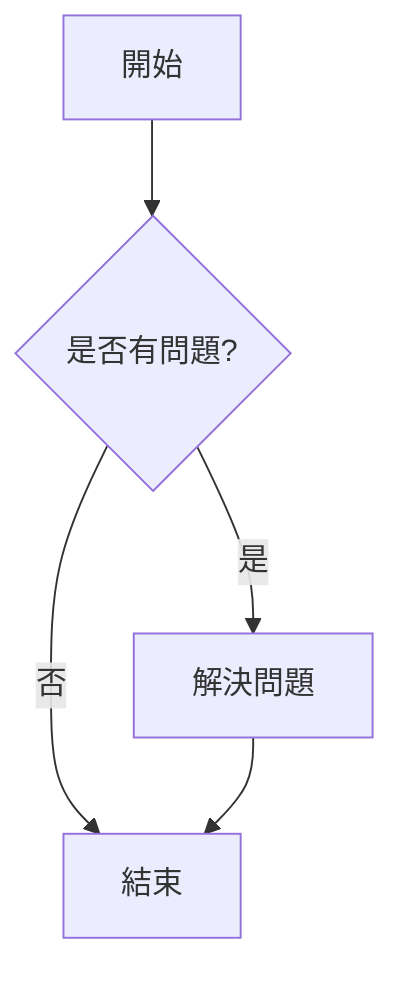
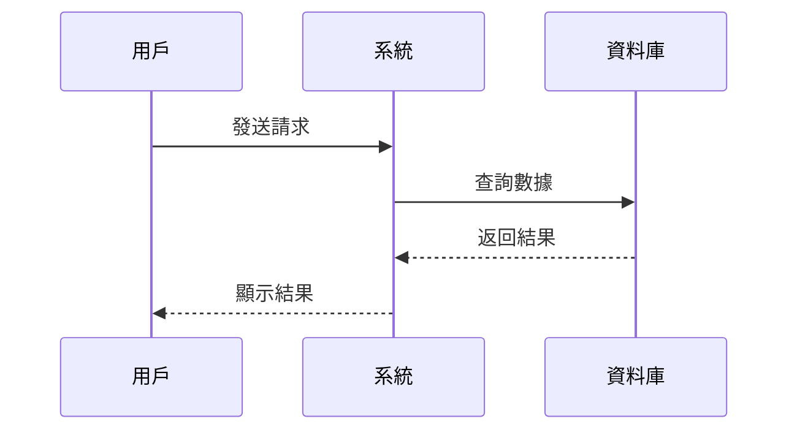
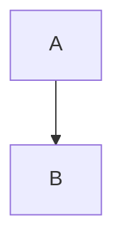
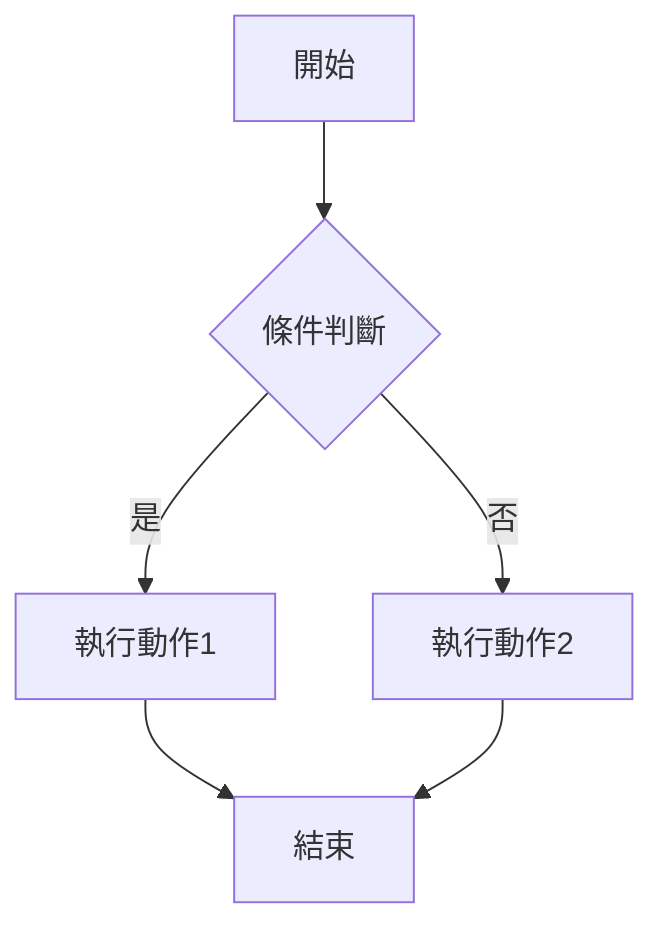
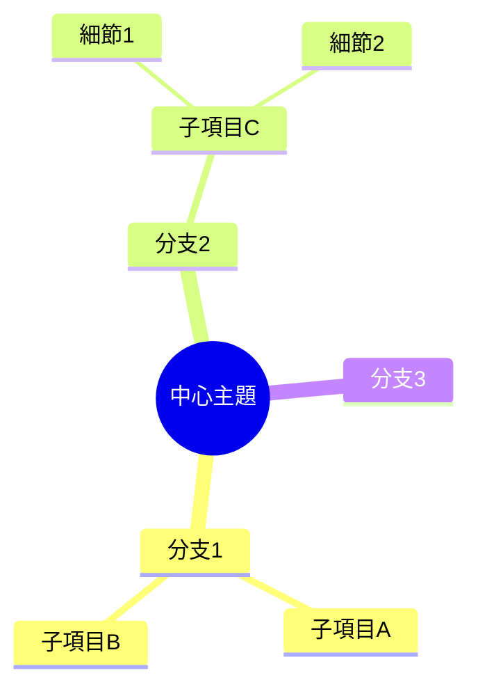

# Mermaid 圖表整合模組技術規格

**文檔版本**: 1.0.0
**最後更新**: 2025-12-26
**狀態**: Draft
**對應規劃**: `docs/FEATURE_PLAN_MD_INTEGRATION.md` - Mermaid 擴展模組

---

## 目錄

1. [模組概述](#1-模組概述)
2. [用戶故事](#2-用戶故事)
3. [功能需求](#3-功能需求)
4. [技術架構](#4-技術架構)
5. [AI 輔助功能](#5-ai-輔助功能)
6. [組件規格](#6-組件規格)
7. [UI/UX 規格](#7-uiux-規格)
8. [API 設計](#8-api-設計)
9. [驗收標準](#9-驗收標準)
10. [實作計劃](#10-實作計劃)

---

## 1. 模組概述

### 1.1 功能目標

Mermaid 圖表整合模組旨在為 ShotBoard 提供強大的圖表生成能力，使用戶能夠：

- 使用簡單文字語法快速創建專業圖表
- 透過 AI 輔助自動生成 Mermaid 代碼
- 在 Markdown 筆記中嵌入動態圖表
- 將圖表導出為 SVG/PNG 格式
- 在白板上直接渲染 Mermaid 圖表

### 1.2 Mermaid 支援的圖表類型

| 類型 | 說明 | 優先級 |
|------|------|--------|
| Flowchart | 流程圖 - 描述流程與決策邏輯 | P0 |
| Mind Map | 心智圖 - 思維導圖 | P0 |

#### 未來擴展 (按需添加)

| 類型 | 說明 |
|------|------|
| Sequence Diagram | 序列圖 |
| Class Diagram | 類別圖 |
| State Diagram | 狀態圖 |
| Gantt Chart | 甘特圖 |
| Pie Chart | 圓餅圖 |

### 1.3 功能範圍

#### 包含 (In Scope)

| 範疇 | 說明 |
|------|------|
| Markdown 嵌入 | 在 Markdown 中使用 ```mermaid 代碼塊 |
| 即時預覽 | 編輯時即時渲染圖表 |
| AI 生成 | 使用自然語言描述生成 Mermaid 代碼 |
| 圖表編輯器 | 專用的 Mermaid 編輯面板 |
| 錯誤處理 | 語法錯誤提示與修正建議 |
| 導出功能 | 導出為 SVG/PNG |
| 模板庫 | 預設圖表模板快速開始 |

#### 不包含 (Out of Scope)

| 範疇 | 說明 | 規劃階段 |
|------|------|----------|
| 圖表協作 | 多人即時編輯圖表 | Future |
| 圖表動畫 | 動態動畫效果 | Future |
| 自定義樣式主題 | 進階主題自定義 | Phase 2 |

### 1.4 技術依賴

```json
{
  "mermaid": "^11.x",
  "rehype-mermaid": "^3.x",
  "@anthropic-ai/sdk": "^0.x"  // AI 生成功能
}
```

---

## 2. 用戶故事

### 2.1 核心用戶故事

#### US-M01: 在筆記中創建圖表
> 作為一名用戶，我希望在 Markdown 筆記中使用 Mermaid 語法創建圖表，以便可視化我的想法。

**驗收條件**:
- [ ] 可在 Markdown 中使用 ```mermaid 代碼塊
- [ ] 圖表在預覽區即時渲染
- [ ] 支援所有 P0/P1 圖表類型

#### US-M02: AI 輔助生成圖表
> 作為一名用戶，我希望用自然語言描述我的想法，讓 AI 自動生成 Mermaid 代碼。

**驗收條件**:
- [ ] 提供 AI 生成按鈕/快捷鍵
- [ ] 支援中英文自然語言輸入
- [ ] 生成的代碼可直接預覽
- [ ] 可對生成結果進行修改與微調

#### US-M03: 圖表模板快速開始
> 作為一名用戶，我希望能從模板庫選擇圖表類型快速開始，降低學習成本。

**驗收條件**:
- [ ] 提供常用圖表類型模板
- [ ] 模板包含示例代碼與說明
- [ ] 一鍵插入模板到編輯器

#### US-M04: 圖表導出
> 作為一名用戶，我希望能將圖表導出為圖片格式，用於簡報或文檔。

**驗收條件**:
- [ ] 支援導出為 SVG 格式
- [ ] 支援導出為 PNG 格式
- [ ] 可設定導出解析度

#### US-M05: 錯誤提示與修正
> 作為一名用戶，當 Mermaid 語法有錯誤時，我希望看到清晰的錯誤提示與修正建議。

**驗收條件**:
- [ ] 顯示語法錯誤位置與訊息
- [ ] 提供 AI 輔助修正建議
- [ ] 錯誤時顯示最近一次正確的渲染

---

## 3. 功能需求

### 3.1 Markdown 嵌入語法

```markdown
# 我的文檔

這是一個流程圖範例：



接下來是序列圖：


```

### 3.2 AI 生成語法

提供特殊語法觸發 AI 生成：

```markdown
<!-- 方式一：使用 AI 指令塊 -->
:::ai-mermaid
畫一個用戶登入的流程圖，包含：
1. 輸入帳號密碼
2. 驗證帳號
3. 驗證成功則進入首頁
4. 驗證失敗則顯示錯誤並重新輸入
:::

<!-- 方式二：使用快捷鍵 Ctrl+Shift+M 開啟 AI 生成面板 -->
```

### 3.3 圖表配置選項

```markdown

```

支援的配置項：

| 選項 | 類型 | 預設值 | 說明 |
|------|------|--------|------|
| theme | string | "default" | 主題：default, dark, forest, neutral |
| width | string | "100%" | 寬度 |
| height | string | "auto" | 高度 |
| background | string | "transparent" | 背景色 |

---

## 4. 技術架構

### 4.1 系統架構圖

```
┌─────────────────────────────────────────────────────────────────┐
│                        ShotBoard App                             │
├─────────────────────────────────────────────────────────────────┤
│  ┌─────────────────┐  ┌─────────────────┐  ┌─────────────────┐  │
│  │  Markdown       │  │  Mermaid        │  │  AI Service     │  │
│  │  Editor         │──│  Renderer       │──│  (Claude API)   │  │
│  │  (CodeMirror)   │  │                 │  │                 │  │
│  └────────┬────────┘  └────────┬────────┘  └────────┬────────┘  │
│           │                    │                    │           │
│  ┌────────▼────────────────────▼────────────────────▼────────┐  │
│  │                    Mermaid Store (Zustand)                 │  │
│  │  - 圖表狀態管理                                             │  │
│  │  - 渲染緩存                                                 │  │
│  │  - AI 生成歷史                                              │  │
│  └────────────────────────────────────────────────────────────┘  │
│                                                                  │
│  ┌────────────────────────────────────────────────────────────┐  │
│  │                    Mermaid Core                             │  │
│  │  - mermaid.js 核心引擎                                      │  │
│  │  - SVG 渲染                                                 │  │
│  │  - 語法解析                                                 │  │
│  └────────────────────────────────────────────────────────────┘  │
└─────────────────────────────────────────────────────────────────┘
```

### 4.2 核心模組

#### 4.2.1 MermaidRenderer

負責將 Mermaid 代碼渲染為 SVG：

```typescript
interface MermaidRendererProps {
  code: string;
  theme?: 'default' | 'dark' | 'forest' | 'neutral';
  width?: string;
  height?: string;
  onError?: (error: MermaidError) => void;
  onRender?: (svg: string) => void;
}

interface MermaidError {
  message: string;
  line?: number;
  column?: number;
  suggestion?: string;
}
```

#### 4.2.2 MermaidEditor

專用的 Mermaid 代碼編輯器：

```typescript
interface MermaidEditorProps {
  initialCode?: string;
  onChange?: (code: string) => void;
  onInsert?: (code: string) => void;
  showPreview?: boolean;
  showTemplates?: boolean;
  showAIAssist?: boolean;
}
```

#### 4.2.3 AI 生成服務

```typescript
interface MermaidAIService {
  generateFromPrompt(prompt: string): Promise<MermaidGenerationResult>;
  fixSyntaxError(code: string, error: MermaidError): Promise<string>;
  enhanceDiagram(code: string, instruction: string): Promise<string>;
}

interface MermaidGenerationResult {
  code: string;
  type: MermaidDiagramType;
  confidence: number;
  explanation?: string;
}
```

---

## 5. AI 輔助功能

### 5.1 AI 生成流程

```
用戶輸入自然語言描述
         │
         ▼
┌─────────────────────┐
│  Prompt 預處理      │
│  - 語言檢測         │
│  - 圖表類型推斷     │
└──────────┬──────────┘
           │
           ▼
┌─────────────────────┐
│  Claude API 調用    │
│  - System Prompt    │
│  - 上下文注入       │
└──────────┬──────────┘
           │
           ▼
┌─────────────────────┐
│  結果驗證           │
│  - 語法檢查         │
│  - 渲染測試         │
└──────────┬──────────┘
           │
           ▼
  返回 Mermaid 代碼
```

### 5.2 AI System Prompt

```typescript
const MERMAID_AI_SYSTEM_PROMPT = `你是一個專業的 Mermaid 圖表生成助手。

你的任務是根據用戶的自然語言描述，生成準確的 Mermaid 代碼。

## 規則

1. 只輸出有效的 Mermaid 代碼，不要包含任何解釋
2. 使用用戶的語言作為圖表中的文字
3. 優先使用最適合的圖表類型
4. 保持圖表簡潔清晰
5. 節點 ID 使用英文，顯示文字可使用中文

## 支援的圖表類型

- flowchart: 流程圖 (使用 TD 上到下 或 LR 左到右 方向)
- mindmap: 心智圖 (放射狀結構)

## 範例

用戶：畫一個登入流程
輸出：
flowchart TD
    A[開始] --> B[輸入帳號密碼]
    B --> C{驗證}
    C -->|成功| D[進入首頁]
    C -->|失敗| E[顯示錯誤]
    E --> B
    D --> F[結束]

用戶：專案管理的心智圖
輸出：
mindmap
  root((專案管理))
    規劃
      需求分析
      時程安排
      資源配置
    執行
      開發
      測試
      部署
    監控
      進度追蹤
      風險管理
`;
```

### 5.3 AI 功能列表

| 功能 | 說明 | 快捷鍵 |
|------|------|--------|
| 從描述生成 | 自然語言轉 Mermaid | `Ctrl+Shift+M` |
| 語法修正 | 自動修復語法錯誤 | `Ctrl+Shift+F` |
| 圖表優化 | 優化圖表佈局與樣式 | - |
| 代碼解釋 | 解釋現有 Mermaid 代碼 | - |
| 類型轉換 | 在不同圖表類型間轉換 | - |

### 5.4 AI 配置

```typescript
interface MermaidAIConfig {
  // API 配置
  apiKey?: string;           // 使用者自有 API Key
  useBuiltIn?: boolean;      // 使用內建額度

  // 生成配置
  maxRetries: number;        // 最大重試次數
  temperature: number;       // 創意程度 0-1
  preferredLanguage: 'zh' | 'en' | 'auto';

  // 功能開關
  enableAutoFix: boolean;    // 自動語法修正
  enableSuggestions: boolean; // 智能建議
}
```

---

## 6. 組件規格

### 6.1 組件層級

```
MermaidModule/
├── components/
│   ├── MermaidRenderer.tsx      # 核心渲染組件
│   ├── MermaidEditor.tsx        # 編輯器組件
│   ├── MermaidPreview.tsx       # 預覽組件
│   ├── MermaidToolbar.tsx       # 工具欄
│   ├── MermaidTemplates.tsx     # 模板選擇器
│   ├── MermaidAIPanel.tsx       # AI 生成面板
│   └── MermaidErrorBoundary.tsx # 錯誤邊界
├── hooks/
│   ├── useMermaid.ts           # Mermaid 渲染 hook
│   ├── useMermaidAI.ts         # AI 生成 hook
│   └── useMermaidExport.ts     # 導出 hook
├── stores/
│   └── mermaidStore.ts         # 狀態管理
├── services/
│   ├── mermaidService.ts       # Mermaid 核心服務
│   └── mermaidAIService.ts     # AI 服務
├── utils/
│   ├── mermaidParser.ts        # 語法解析
│   └── mermaidExporter.ts      # 導出工具
└── types/
    └── mermaid.ts              # 類型定義
```

### 6.2 MermaidRenderer 組件

```tsx
import React, { useEffect, useRef, useState } from 'react';
import mermaid from 'mermaid';

interface MermaidRendererProps {
  code: string;
  id?: string;
  theme?: 'default' | 'dark' | 'forest' | 'neutral';
  className?: string;
  onError?: (error: Error) => void;
  onSuccess?: (svg: string) => void;
}

export const MermaidRenderer: React.FC<MermaidRendererProps> = ({
  code,
  id = `mermaid-${Date.now()}`,
  theme = 'default',
  className = '',
  onError,
  onSuccess,
}) => {
  const containerRef = useRef<HTMLDivElement>(null);
  const [svg, setSvg] = useState<string>('');
  const [error, setError] = useState<Error | null>(null);

  useEffect(() => {
    const renderDiagram = async () => {
      if (!code.trim()) return;

      try {
        mermaid.initialize({
          startOnLoad: false,
          theme,
          securityLevel: 'strict',
        });

        const { svg } = await mermaid.render(id, code);
        setSvg(svg);
        setError(null);
        onSuccess?.(svg);
      } catch (err) {
        const error = err instanceof Error ? err : new Error(String(err));
        setError(error);
        onError?.(error);
      }
    };

    renderDiagram();
  }, [code, id, theme]);

  if (error) {
    return (
      <div className={`mermaid-error ${className}`}>
        <div className="mermaid-error__icon">⚠️</div>
        <div className="mermaid-error__message">{error.message}</div>
      </div>
    );
  }

  return (
    <div
      ref={containerRef}
      className={`mermaid-container ${className}`}
      dangerouslySetInnerHTML={{ __html: svg }}
    />
  );
};
```

### 6.3 MermaidAIPanel 組件

```tsx
interface MermaidAIPanelProps {
  isOpen: boolean;
  onClose: () => void;
  onGenerate: (code: string) => void;
  initialPrompt?: string;
}

export const MermaidAIPanel: React.FC<MermaidAIPanelProps> = ({
  isOpen,
  onClose,
  onGenerate,
  initialPrompt = '',
}) => {
  const [prompt, setPrompt] = useState(initialPrompt);
  const [isGenerating, setIsGenerating] = useState(false);
  const [preview, setPreview] = useState<string>('');
  const [error, setError] = useState<string>('');

  const handleGenerate = async () => {
    setIsGenerating(true);
    setError('');

    try {
      const result = await mermaidAIService.generateFromPrompt(prompt);
      setPreview(result.code);
    } catch (err) {
      setError(err instanceof Error ? err.message : '生成失敗');
    } finally {
      setIsGenerating(false);
    }
  };

  const handleInsert = () => {
    onGenerate(preview);
    onClose();
  };

  return (
    <div className={`mermaid-ai-panel ${isOpen ? 'open' : ''}`}>
      <div className="mermaid-ai-panel__header">
        <h3>AI 圖表生成</h3>
        <button onClick={onClose}>×</button>
      </div>

      <div className="mermaid-ai-panel__content">
        <textarea
          value={prompt}
          onChange={(e) => setPrompt(e.target.value)}
          placeholder="描述你想要的圖表，例如：畫一個用戶登入的流程圖..."
          rows={4}
        />

        <div className="mermaid-ai-panel__actions">
          <button
            onClick={handleGenerate}
            disabled={isGenerating || !prompt.trim()}
          >
            {isGenerating ? '生成中...' : '生成圖表'}
          </button>
        </div>

        {error && (
          <div className="mermaid-ai-panel__error">{error}</div>
        )}

        {preview && (
          <div className="mermaid-ai-panel__preview">
            <MermaidRenderer code={preview} />
            <div className="mermaid-ai-panel__code">
              <pre><code>{preview}</code></pre>
            </div>
            <button onClick={handleInsert}>插入到編輯器</button>
          </div>
        )}
      </div>
    </div>
  );
};
```

---

## 7. UI/UX 規格

### 7.1 視覺設計

#### 圖表渲染區

```css
.mermaid-container {
  padding: 16px;
  background: var(--bg-secondary);
  border-radius: 8px;
  overflow: auto;
  min-height: 100px;
}

.mermaid-container svg {
  max-width: 100%;
  height: auto;
}
```

#### 錯誤顯示

```css
.mermaid-error {
  display: flex;
  align-items: center;
  gap: 8px;
  padding: 12px 16px;
  background: var(--error-bg);
  border: 1px solid var(--error-border);
  border-radius: 8px;
  color: var(--error-text);
}
```

#### AI 生成面板

```css
.mermaid-ai-panel {
  position: fixed;
  right: 0;
  top: 0;
  width: 400px;
  height: 100vh;
  background: var(--bg-primary);
  box-shadow: -4px 0 16px rgba(0, 0, 0, 0.1);
  transform: translateX(100%);
  transition: transform 0.3s ease;
}

.mermaid-ai-panel.open {
  transform: translateX(0);
}
```

### 7.2 工具欄設計

```
┌────────────────────────────────────────────────────────────┐
│ [📊 模板 ▼] [🤖 AI 生成] [📋 複製] [💾 導出 ▼] [⚙️ 設定] │
└────────────────────────────────────────────────────────────┘
```

### 7.3 快捷鍵

| 快捷鍵 | 功能 |
|--------|------|
| `Ctrl+Shift+M` | 開啟 AI 生成面板 |
| `Ctrl+Shift+P` | 切換預覽 |
| `Ctrl+E` | 導出圖表 |
| `Ctrl+T` | 開啟模板選擇器 |
| `Escape` | 關閉面板 |

---

## 8. API 設計

### 8.1 Mermaid Store

```typescript
interface MermaidState {
  // 狀態
  diagrams: Map<string, MermaidDiagram>;
  activeId: string | null;
  isAIPanelOpen: boolean;
  aiGenerationHistory: AIGenerationRecord[];

  // 配置
  config: MermaidConfig;

  // Actions
  addDiagram: (id: string, code: string) => void;
  updateDiagram: (id: string, code: string) => void;
  removeDiagram: (id: string) => void;
  setActiveDiagram: (id: string | null) => void;
  toggleAIPanel: () => void;
  updateConfig: (config: Partial<MermaidConfig>) => void;
}

interface MermaidDiagram {
  id: string;
  code: string;
  type: MermaidDiagramType;
  renderedSvg?: string;
  lastError?: MermaidError;
  createdAt: number;
  updatedAt: number;
}

interface MermaidConfig {
  theme: 'default' | 'dark' | 'forest' | 'neutral';
  fontSize: number;
  fontFamily: string;
  securityLevel: 'strict' | 'loose' | 'antiscript';
}
```

### 8.2 AI 服務 API

```typescript
class MermaidAIService {
  private apiKey: string;

  async generateFromPrompt(prompt: string): Promise<MermaidGenerationResult> {
    const response = await fetch('/api/ai/mermaid', {
      method: 'POST',
      headers: { 'Content-Type': 'application/json' },
      body: JSON.stringify({
        prompt,
        systemPrompt: MERMAID_AI_SYSTEM_PROMPT,
      }),
    });

    if (!response.ok) {
      throw new Error('AI 生成失敗');
    }

    return response.json();
  }

  async fixSyntaxError(code: string, error: MermaidError): Promise<string> {
    const prompt = `修復以下 Mermaid 代碼的語法錯誤：

錯誤訊息：${error.message}
${error.line ? `錯誤行：${error.line}` : ''}

原始代碼：
${code}

請只輸出修正後的 Mermaid 代碼。`;

    const result = await this.generateFromPrompt(prompt);
    return result.code;
  }
}
```

### 8.3 導出 API

```typescript
interface ExportOptions {
  format: 'svg' | 'png';
  scale?: number;        // PNG 放大倍數
  background?: string;   // 背景色
  padding?: number;      // 邊距
}

async function exportMermaidDiagram(
  svg: string,
  options: ExportOptions
): Promise<Blob> {
  if (options.format === 'svg') {
    return new Blob([svg], { type: 'image/svg+xml' });
  }

  // PNG 導出需要轉換
  const canvas = document.createElement('canvas');
  const ctx = canvas.getContext('2d');
  const img = new Image();

  return new Promise((resolve, reject) => {
    img.onload = () => {
      const scale = options.scale || 2;
      canvas.width = img.width * scale;
      canvas.height = img.height * scale;

      if (options.background) {
        ctx.fillStyle = options.background;
        ctx.fillRect(0, 0, canvas.width, canvas.height);
      }

      ctx.drawImage(img, 0, 0, canvas.width, canvas.height);
      canvas.toBlob(resolve, 'image/png');
    };

    img.onerror = reject;
    img.src = 'data:image/svg+xml;base64,' + btoa(svg);
  });
}
```

---

## 9. 驗收標準

### 9.1 功能驗收

| 編號 | 驗收項目 | 驗收條件 |
|------|----------|----------|
| AC-01 | 流程圖渲染 | 正確渲染 flowchart 代碼塊 |
| AC-02 | 心智圖渲染 | 正確渲染 mindmap 代碼塊 |
| AC-03 | 即時預覽 | 編輯代碼後 500ms 內更新預覽 |
| AC-04 | 錯誤處理 | 語法錯誤時顯示錯誤訊息而非崩潰 |
| AC-05 | AI 生成 | 自然語言可生成流程圖/心智圖 |
| AC-06 | 模板插入 | 提供流程圖、心智圖模板 |
| AC-07 | 導出 | 可導出為 SVG/PNG |

### 9.2 效能驗收

| 編號 | 驗收項目 | 驗收條件 |
|------|----------|----------|
| PF-01 | 渲染速度 | 單一圖表渲染時間 < 200ms |
| PF-02 | AI 響應 | AI 生成回應時間 < 5s |
| PF-03 | 記憶體 | 10 個圖表同時渲染，記憶體增量 < 50MB |

### 9.3 相容性驗收

| 編號 | 驗收項目 | 驗收條件 |
|------|----------|----------|
| CP-01 | 圖表類型 | 支援流程圖 (flowchart) 與心智圖 (mindmap) |
| CP-02 | 瀏覽器 | 支援 Chromium (Electron) |
| CP-03 | 現有整合 | 不影響現有 Markdown 功能 |

---

## 10. 實作計劃

### Phase 1: 核心渲染 (P0)

**目標**: 實現基本的 Mermaid 渲染能力

| 任務 | 說明 | 優先級 |
|------|------|--------|
| 安裝依賴 | `npm install mermaid` | P0 |
| MermaidRenderer | 實作核心渲染組件 | P0 |
| Markdown 整合 | 整合到 MarkdownPreview | P0 |
| 錯誤處理 | 實作錯誤邊界與顯示 | P0 |

**交付物**:
- `src/components/Mermaid/MermaidRenderer.tsx`
- `src/components/Editor/MarkdownPreview.tsx` (更新)
- 基本 CSS 樣式

### Phase 2: 編輯體驗 (P1)

**目標**: 提升編輯與預覽體驗

| 任務 | 說明 | 優先級 |
|------|------|--------|
| 即時預覽 | Debounced 即時渲染 | P1 |
| 語法高亮 | CodeMirror Mermaid 高亮 | P1 |
| 模板庫 | 預設模板選擇器 | P1 |
| 工具欄 | Mermaid 專用工具欄 | P1 |

**交付物**:
- `src/components/Mermaid/MermaidEditor.tsx`
- `src/components/Mermaid/MermaidTemplates.tsx`
- `src/components/Mermaid/MermaidToolbar.tsx`

### Phase 3: AI 整合 (P1)

**目標**: 實現 AI 輔助生成功能

| 任務 | 說明 | 優先級 |
|------|------|--------|
| AI 服務 | Claude API 整合 | P1 |
| 生成面板 | AI 生成 UI | P1 |
| 語法修正 | AI 錯誤修正 | P2 |
| 配置管理 | API Key 管理 | P1 |

**交付物**:
- `src/services/mermaidAIService.ts`
- `src/components/Mermaid/MermaidAIPanel.tsx`
- `src/stores/mermaidStore.ts`

### Phase 4: 導出與優化 (P2)

**目標**: 完善導出功能與效能優化

| 任務 | 說明 | 優先級 |
|------|------|--------|
| SVG 導出 | 導出為 SVG | P2 |
| PNG 導出 | 導出為 PNG | P2 |
| 渲染緩存 | 實作渲染緩存 | P2 |
| 效能優化 | 大型圖表優化 | P2 |

**交付物**:
- `src/utils/mermaidExporter.ts`
- 效能優化文檔

---

## 附錄

### A. Mermaid 語法速查

#### 流程圖 (Flowchart)



**節點形狀**:
- `[文字]` 矩形
- `{文字}` 菱形 (判斷)
- `([文字])` 圓角矩形
- `((文字))` 圓形
- `>文字]` 旗幟形

**方向**:
- `TD` / `TB` 上到下
- `LR` 左到右
- `RL` 右到左
- `BT` 下到上

#### 心智圖 (Mind Map)



**語法規則**:
- 使用縮排表示層級
- `root((文字))` 中心節點
- 子節點直接縮排即可

### B. 參考資源

- [Mermaid 官方文檔](https://mermaid.js.org/)
- [Mermaid Live Editor](https://mermaid.live/)
- [Claude API 文檔](https://docs.anthropic.com/)
